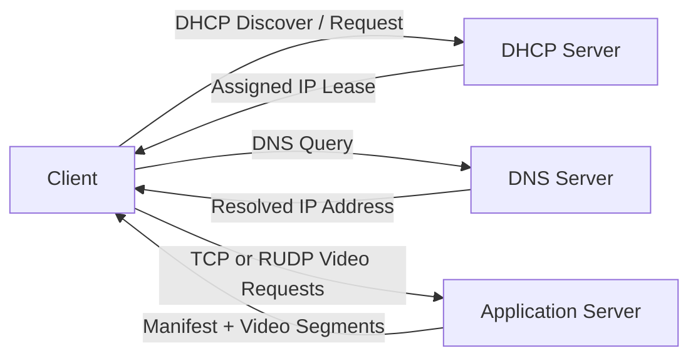
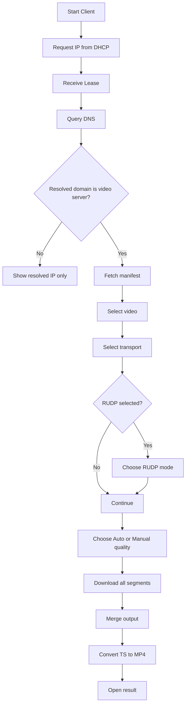

# 🎬 Network Final Project
## Adaptive Video Streaming over TCP and RUDP


## 📌 Overview

This project presents a simplified network-based video delivery system implemented in Python.

It combines several networking components into one integrated application, including:

- DHCP client/server for dynamic IP assignment
- DNS client/server for domain name resolution
- Application server for segmented video delivery
- TCP and custom Reliable UDP (RUDP) transport
- Manual and adaptive quality selection

The purpose of the project is to demonstrate how a client can obtain an IP address, resolve a service name, connect to a video server, and download segmented video while comparing different transport mechanisms.

---

## ✨ Main Features

- Dynamic IP assignment using **DHCP**
- Domain name resolution using **DNS**
- Video delivery over **TCP**
- Video delivery over **custom Reliable UDP (RUDP)**
- Support for:
  - **Stop & Wait**
  - **Go-Back-N**
  - **Selective Repeat**
- Manual quality selection:
  - `low`
  - `mid`
  - `high`
- Adaptive quality selection based on measured bandwidth
- Packet loss simulation for RUDP testing
- Logging, runtime metrics, and summary statistics
- Automatic TS to MP4 conversion after download

---

## 🧱 System Architecture



---

## 🔁 Client Execution Flow

---
## 🗂️ Project Structure

```text
finalProject/
├── assets/
│   └── videos/
│       ├── video1/
│       │   ├── low/
│       │   ├── mid/
│       │   └── high/
│       └── video2/
│           ├── low/
│           ├── mid/
│           └── high/
│
├── client/
│   ├── app_client.py
│   ├── dhcp_client.py
│   └── dns_client.py
│
├── protocol/
│   ├── config.py
│   ├── logger.py
│   └── rudp.py
│
├── servers/
│   ├── app_server.py
│   ├── dhcp_server.py
│   └── dns_server.py
│
├── video_sources/
│   ├── video1.mp4
│   └── video2.mp4
│
├── prepare_video.py
└── README.md
```
---

## 🚀 How to Run

Open **four separate terminals** from the project root.

### 1️⃣ Start DHCP Server
```bash
python servers/dhcp_server.py
```
### 2️⃣ Start DNS Server
```bash
python servers/app_server.py
```
### 3️⃣ Start Application Server
```bash
python servers/app_server.py
```
### 4️⃣ Start Client
```bash
python client/app_client.py
```
---
### 🎥 Preparing Videos
---
Place source video files inside:
```bash
video_sources/
```
Then run:
```bash
python prepare_video.py
```
This script generates segmented videos in multiple quality levels under:
```bash
assets/videos/
```
Example:
---
```bash
assets/videos/barcelona/
├── low/
├── mid/
└── high/
```

---
### ⚙️ Supported Transport Modes
- Transport	Mode	Description
- TCP	Built-in	Reliable transport using standard TCP
- RUDP	Stop & Wait	Sends one packet at a time, simple but slower
- RUDP	Go-Back-N	Uses a sending window, retransmits a range on loss
- RUDP	Selective Repeat	Retransmits only missing packets, usually most efficient

---
### 📶 Streaming Modes
Mode	Behavior
Manual	User selects a fixed quality for all segments
Auto	Client estimates bandwidth and adjusts the next segment quality
---
### 🧪 Educational Concepts Demonstrated

- DHCP lease allocation
- DNS name resolution
- TCP vs UDP behavior
- Reliability over UDP
- Packet loss and retransmissions
- Window-based transmission
- Adaptive video streaming
- Client-server architecture
- Logging and runtime analysis

---

## 📝 Usage Flow

- The client requests an IP address from the DHCP server.
- The client queries the DNS server for a domain name.
- If the domain points to the video application server, the client continues.
- The client downloads the video manifest. 
#### The user selects:
1.  video
2.  transport protocol
3. an RUDP mode (if needed)
4. manual or adaptive quality mode
5. The client downloads all video segments.
6. The output is saved locally and reconstructed into an MP4 file.
---
## 📊 Expected Behavior

- TCP usually provides very fast and stable transfer on localhost.
- RUDP makes packet loss, acknowledgments, and retransmissions more visible.
- Under packet loss:
- Go-Back-N may reduce effective throughput more aggressively
- Selective Repeat usually performs better than Go-Back-N
- In Auto mode, lower measured bandwidth may cause the next segment quality to drop to mid or low

--- 

# **Developed by**  
**Amitai Buzaglo · Ofri Ben Shabo · Daniel Kfir**

**Department:** Computer Science  
**Institution:** Ariel University  
**Academic Level:** Second-year undergraduate students

---